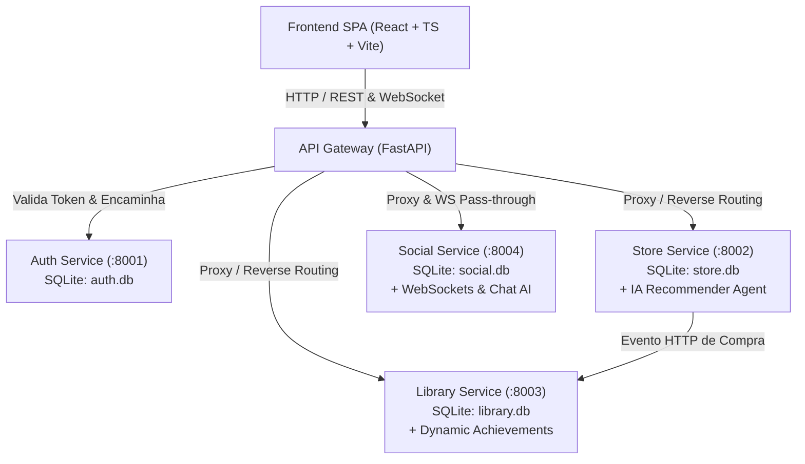

# MIST — Arquitetura de Microsserviços e Sistema

O **MIST** é uma prova de conceito (POC) que recria o ecossistema da Steam utilizando uma arquitetura orientada a microsserviços, frontend moderno em React + TypeScript e inteligência artificial aplicada.

---

## 1. Visão Geral da Arquitetura

O sistema é composto por um **API Gateway**, 4 **Microsserviços de Domínio** independentes e uma aplicação **Frontend SPA**, orquestrados localmente via Docker Compose.

---

## 2. Microsserviços e Responsabilidades

### 2.1. API Gateway (`/gateway`)
- **Porta:** 8000
- **Função:** Ponto único de entrada (Single Point of Entry) para o frontend.
- **Responsabilidades:**
  - Roteamento reverso para os microsserviços internos.
  - Validação centralizada de tokens JWT (Bearer Token).
  - Injeção de cabeçalhos de identidade confiáveis (`X-User-Id`, `X-User-Email`, `X-User-Role`) para os serviços internos.
  - Tratamento de CORS, rate limiting e terminação de conexões.

### 2.2. Auth Service (`/services/auth-service`)
- **Porta:** 8001
- **Banco:** `auth.db` (SQLite)
- **Responsabilidades:**
  - Registro de usuários, autenticação, hash seguro de senhas (bcrypt/argon2).
  - Emissão e renovação de tokens JWT (Access & Refresh tokens).
  - Perfil de usuário básico (avatar, nick, status, email).

### 2.3. Store Service (`/services/store-service`)
- **Porta:** 8002
- **Banco:** `store.db` (SQLite)
- **Responsabilidades:**
  - Catálogo de jogos (título, descrição, preço, tags, screenshots, trailer, arquivos de instalação mock).
  - Lista de Desejos (Wishlist) dos usuários.
  - Simulação de compra e checkout.
  - **Módulo de IA (Curator Agent):** Análise de perfil, recomendações contextuais e "Seu Estilo".
  - Servidor de arquivos estáticos simulando os downloads/instalações de jogos.

### 2.4. Library Service (`/services/library-service`)
- **Porta:** 8003
- **Banco:** `library.db` (SQLite)
- **Responsabilidades:**
  - Registro de posse de jogos por usuário.
  - Controle de tempo de jogo acumulado (playtime), status de download e execução local simulada.
  - Sistema de Troféus/Conquistas (Achievements): catálogo de troféus, progresso e desbloqueio.
  - Histórico de sessões de jogo.

### 2.5. Social Service (`/services/social-service`)
- **Porta:** 8004
- **Banco:** `social.db` (SQLite)
- **Responsabilidades:**
  - Gerenciamento de amizades (solicitações, aceites, bloqueios, status online/em jogo).
  - Chat em tempo real entre amigos utilizando WebSockets.
  - Feed de atividades públicas (ex: *"Usuário X desbloqueou a conquista Y no jogo Z"*).
  - **Módulo de IA (Community Assistant / Moderador):** Filtragem de toxicidade ou bot de assistência.

---

## 3. Comunicação Inter-serviços e Consistência

1. **Autenticação Stateless:**
   - O `auth-service` assina o JWT com chave secreta simétrica (ou par assimétrico RSA).
   - O `gateway` valida o token e propaga o ID do usuário através do header HTTP `X-User-Id`.
   - Os serviços internos confiam no header repassado pelo Gateway (quando dentro da rede interna docker).

2. **Fluxo de Compra e Posse de Jogos:**
   - Quando o usuário conclui uma compra no `store-service`, o serviço emite uma requisição HTTP síncrona interna (usando `httpx`) para o endpoint de concessão de licença do `library-service` (`POST http://library-service:8003/api/library/grant`).

3. **Arquivos de Jogos Simulados (Game Downloads):**
   - O `store-service` / `library-service` disponibiliza arquivos empacotados (ex: `.zip` ou scripts executáveis leves com executáveis mock) via endpoint de download em streaming, simulando barra de progresso no cliente.

---

## 4. Agentes de IA Integrados ao Ecossistema

| Agente | Serviço | Função |
| :--- | :--- | :--- |
| **MIST Curator & Recommender** | `store-service` | Gera vitrines personalizadas e justificativas contextuais em linguagem natural combinando tags e biblioteca. |
| **MIST Dynamic Quest Master** | `library-service` | Gera desafios dinâmicos semanais e troféus sazonais para jogos da biblioteca. |
| **MIST Chatbot / NPC Companion** | `social-service` | Bot de chat acessível na lista de amigos para tirar dúvidas sobre promoções, estatísticas e novidades do ecossistema. |

---

## 5. Runners de Testes e Estratégia de QA

A pirâmide de testes do MIST é distribuída entre os seguintes runners conforme o domínio e a granularidade da camada:

| Runner | Camada / Escopo | Linguagem | Tipos de Teste | Justificativa Técnica |
| :--- | :--- | :--- | :--- | :--- |
| **`pytest`** | Backend (API Gateway e os 4 Microsserviços) | Python | Unitários, Integração de serviços, Regressão e Smoke | Padrão do ecossistema FastAPI/Python com suporte assíncrono (`pytest-asyncio`) e testes de cliente HTTP via `httpx`. |
| **`vitest`** | Frontend SPA (React + TypeScript) | TypeScript | Unitários, Integração de componentes e Regressão de UI | Compatibilidade nativa com a configuração do Vite e TypeScript, oferecendo execução ultrarrápida em memória para componentes. |
| **`playwright`** | Sistema Completo / End-to-End (E2E) | TypeScript | E2E e Smoke de fluxos integrados | Suporte nativo a browsers reais, automação de fluxos ponta a ponta (compra, login, navegação) e comunicação WebSocket em tempo real. |

### 5.1. Arquitetura de Configuração e Desacoplamento

1. **Backend Python (`pytest`):**
   - **Ambiente Virtual Unificado (`.venv/`):** Um único ambiente na raiz gerencia as ferramentas de teste compartilhadas (`requirements-dev.txt`), eliminando troca constante de ambientes virtuais.
   - **Resolução de Microsserviços (`pyproject.toml`):** Configura a chave `tool.pytest.ini_options.pythonpath` apontando para `gateway` e para os 4 microsserviços (`auth-service`, `store-service`, `library-service`, `social-service`), permitindo que a IA e os desenvolvedores executem qualquer teste do backend sem falhas de importação de módulos.

2. **Frontend & E2E (`vitest` + `playwright`):**
   - **Centralização de Tooling TypeScript (`frontend/package.json`):** Ambos os runners residem sob o mesmo `package.json` do frontend, garantindo instalação em comando único (`npm install`), compartilhamento de tipos e ausência de duplicação de `node_modules`.
   - **Configurações Dedicadas:** `frontend/vitest.config.ts` para testes rápidos em DOM simulado (`jsdom`) e `frontend/playwright.config.ts` configurado para múltiplos navegadores (Chromium, Firefox, WebKit) e orquestração automática do servidor de desenvolvimento.

### 5.2. Padrão de Execução por Agentes de IA

Para minimizar o atrito e evitar comandos aninhados (`cd`), todos os testes são configurados para disparo a partir da raiz do repositório:
- Backend: `pytest` ou `pytest services/<servico>/tests`
- Frontend Unitário: `npm --prefix frontend run test:unit`
- E2E Sistema Completo: `npm --prefix frontend run test:e2e`

